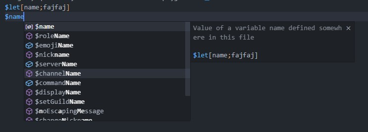
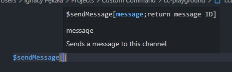

# Custom Command bot
Add Custom Command's syntax to your Visual Studio Code!

## What's Custom Command?
Custom Command bot is a discord bot that lets you create custom commands with over 500 functions/tags. Autoroles Tickets, Embeds, Welcomer and much more. It can easily replace Yagpdb, Mee6, Carl...
 - [Official website](https://ccommandbot.com)
 - [Support server](https://ccommandbot.com/join)

## Features
- ### Tokenization
    The code will get nicely colored as you type.
 > 

- ### Auto completion 
    Everytime you place a `$` you will receive a list of suggested completions.
    This also contains your previously assigned variables.
 > 

- ### Signature help
    When you open a bracket, or type a `;` you will get a quick reference of the parameters whih the function accepts.
> 
- ### Auto update
    The extension will automatically fetch the latest list of functions every week.

## How do I use it?
1. Install
2. Create a file with `.ccbot` extension
3. Type in the code
4. Copy & paste the code into the [dashboard](https://ccommandbot.com/dashboard).

## Is this an official Custom Command bot extension?
No, this is an extension developed by `fajfaj#6941` with a consent of the actual bot developers.

## Feedback
I'd love to hear your opinion on this extension, please leave an honest review at the [visual sudio marketplace](https://marketplace.visualstudio.com/items?itemName=fajfaj.ccbot&ssr=false#review-details). Thanks!

## Troubleshooting
If you find any bugs, have questions, or want to suggest a feature, feel free to reach out to `fajfaj#6941` on CC [support server](https://ccommandbot.com/join)